# 📊 SIMRP - User Flow, Use Case & Architecture Diagrams

Dokumentasi visual untuk user flow, use case, dan arsitektur SIMRP.

---

##  TABLE OF CONTENTS

### User Flow & Use Case
1. [Use Case Diagram](#1-use-case-diagram)
2. [User Flow - Relawan](#2-user-flow---relawan)
3. [User Flow - Submit Report](#3-user-flow---submit-report)
4. [User Flow - Approve Event](#4-user-flow---approve-event)
5. [User Flow - Verify Report](#5-user-flow---verify-report)
6. [Event Lifecycle](#6-event-lifecycle)
7. [State Diagram - Event](#7-state-diagram---event)
8. [State Diagram - Report](#8-state-diagram---report)
9. [Sequence Diagram - Login](#9-sequence-diagram---login)
10. [Sequence Diagram - Submit Report](#10-sequence-diagram---submit-report)

### Architecture Diagrams
11. [System Overview](#11-system-overview)
12. [Backend Architecture](#12-backend-architecture)
13. [Frontend Architecture](#13-frontend-architecture)
14. [Deployment Architecture](#14-deployment-architecture)
15. [Data Flow Architecture](#15-data-flow-architecture)
16. [Security Architecture](#16-security-architecture)
17. [Database Schema](#17-database-schema)

### Documentation
18. [Activity Matrix](#18-activity-matrix)
19. [Actor Definitions](#19-actor-definitions)

---

## 1. USE CASE DIAGRAM

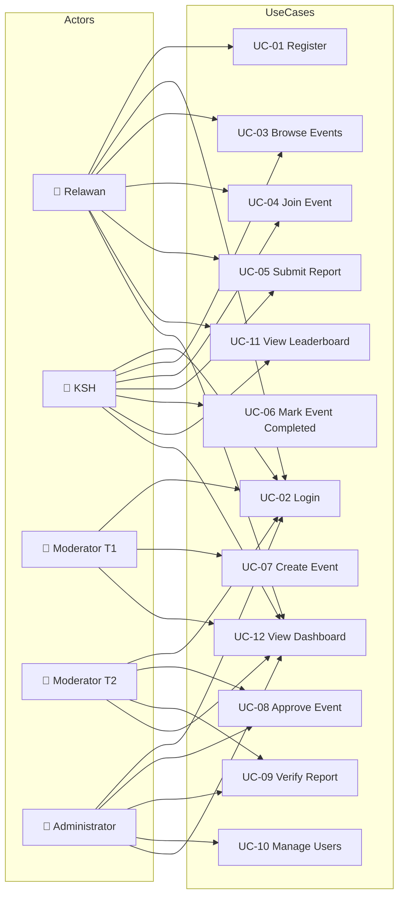

---

## 2. USER FLOW - RELAWAN

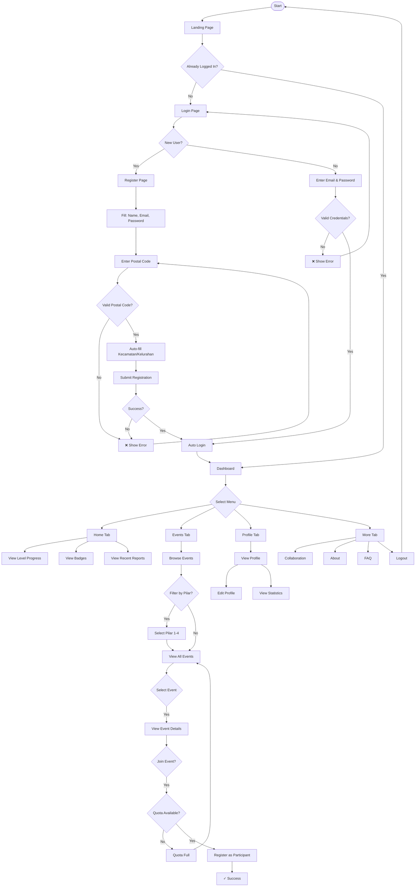

---

## 3. USER FLOW - SUBMIT REPORT

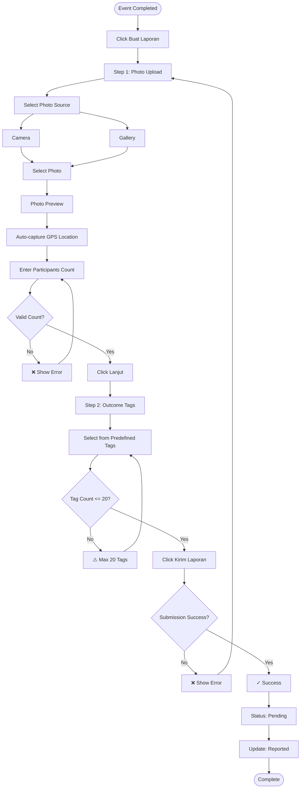

---

## 4. USER FLOW - APPROVE EVENT

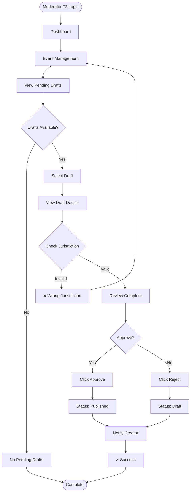

---

## 5. USER FLOW - VERIFY REPORT

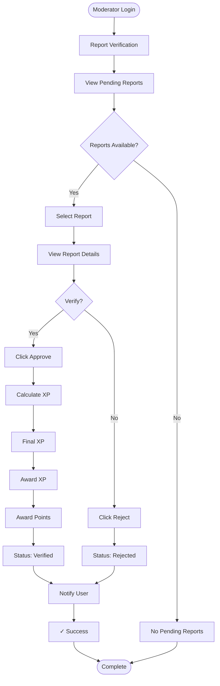

---

## 6. EVENT LIFECYCLE

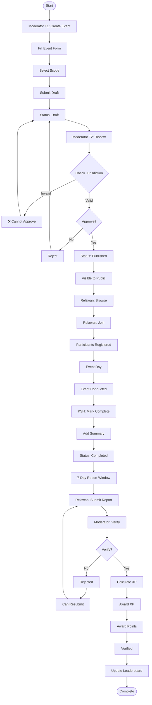

---

## 7. STATE DIAGRAM - EVENT

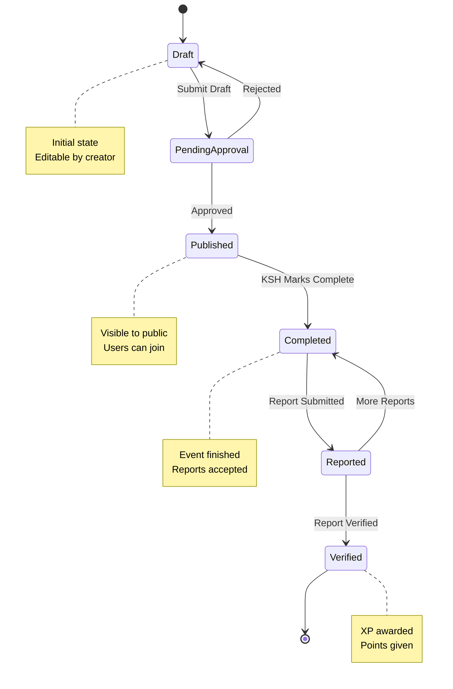

---

## 8. STATE DIAGRAM - REPORT

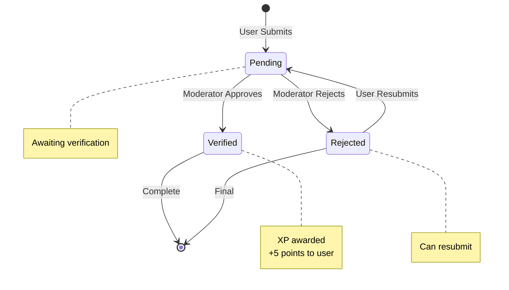

---

## 9. SEQUENCE DIAGRAM - LOGIN

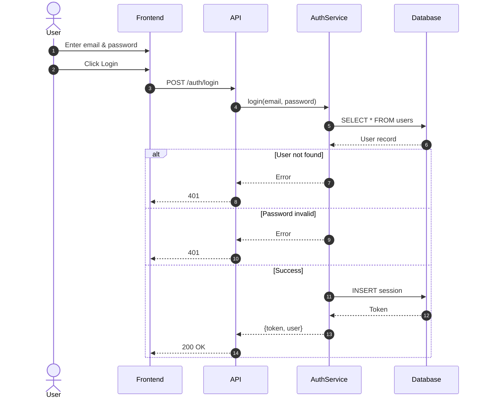

---

## 10. SEQUENCE DIAGRAM - SUBMIT REPORT

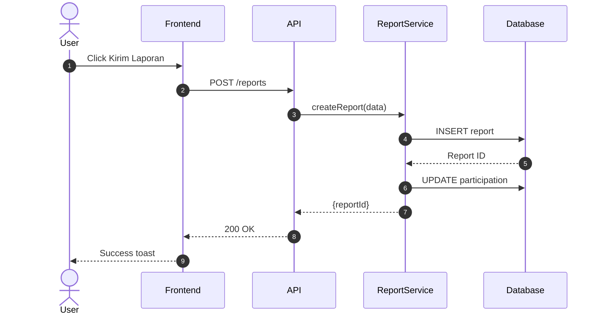

---

## 11. SYSTEM OVERVIEW

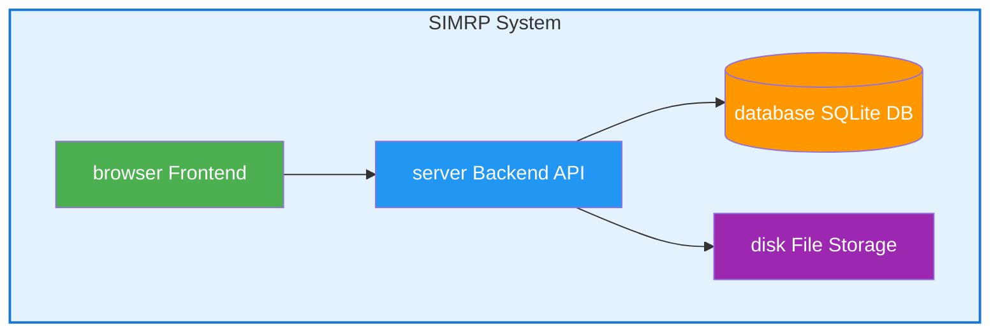

---

## 12. BACKEND ARCHITECTURE

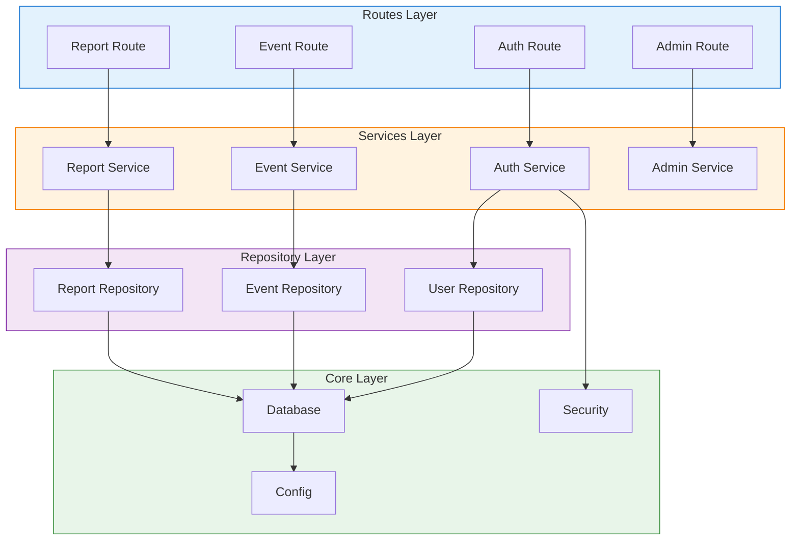

---

## 13. FRONTEND ARCHITECTURE

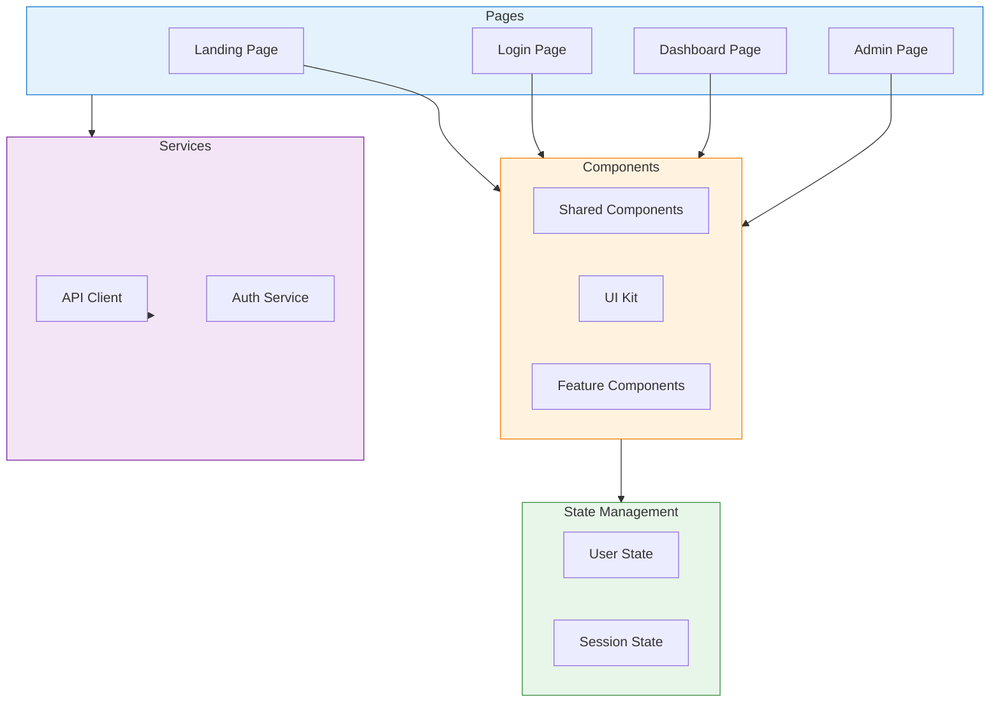

---

## 14. DEPLOYMENT ARCHITECTURE

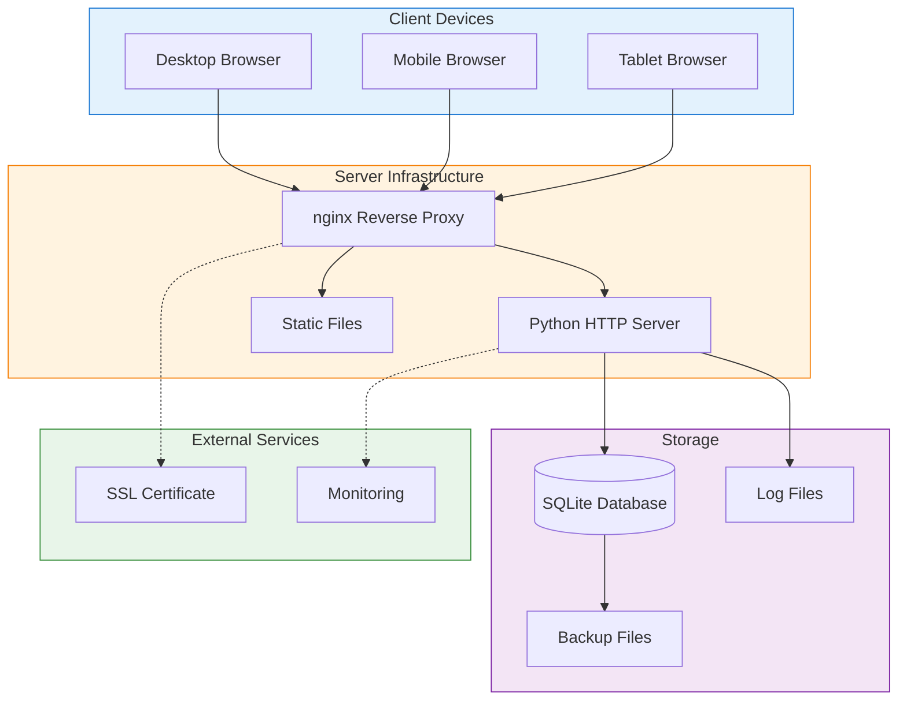

---

## 15. DATA FLOW ARCHITECTURE

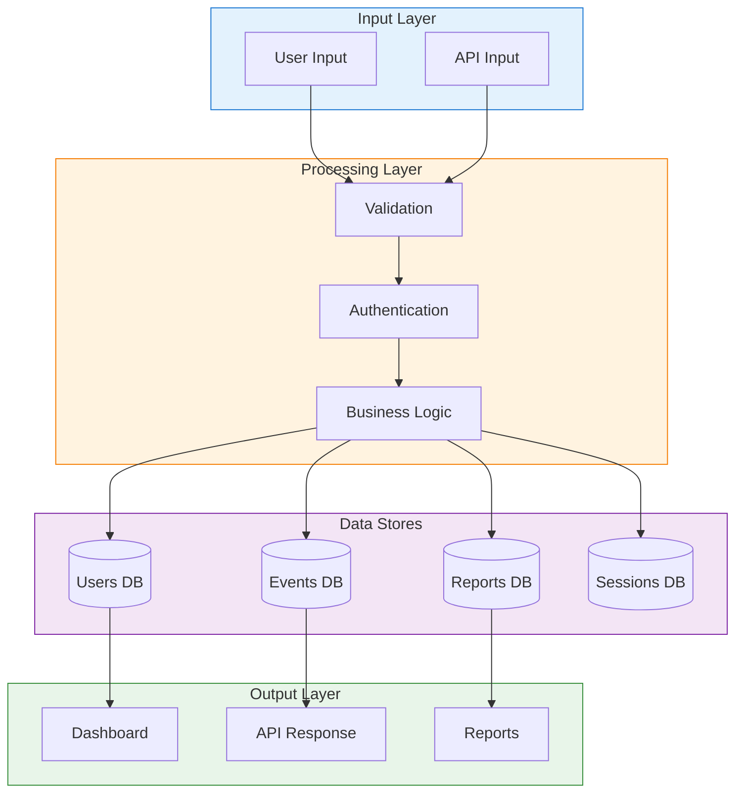

---

## 16. SECURITY ARCHITECTURE

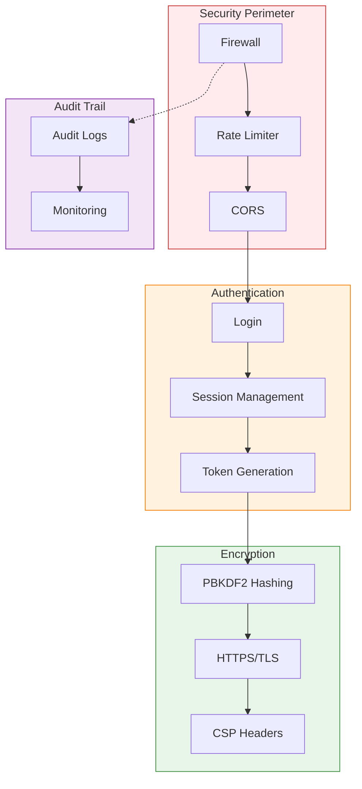

---

## 17. DATABASE SCHEMA

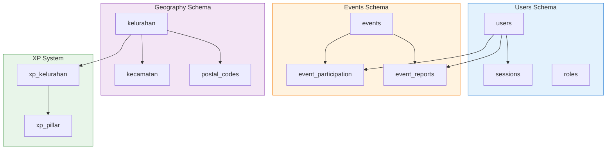

---

## 18. ACTIVITY MATRIX

| Use Case | Relawan | KSH | Mod T1 | Mod T2 | Mod T3 | Admin |
|----------|:-------:|:---:|:------:|:------:|:------:|:-----:|
| UC-01 Register | ✅ | ✅ | ❌ | ❌ | ❌ | ❌ |
| UC-02 Login | ✅ | ✅ | ✅ | ✅ | ✅ | ✅ |
| UC-03 Browse Events | ✅ | ✅ | ✅ | ✅ | ✅ | ✅ |
| UC-04 Join Event | ✅ | ✅ | ❌ | ❌ | ❌ | ❌ |
| UC-05 Submit Report | ✅ | ✅ | ❌ | ❌ | ❌ | ❌ |
| UC-06 Mark Event Completed | ❌ | ✅ | ❌ | ❌ | ❌ | ❌ |
| UC-07 Create Event | ❌ | ✅ | ✅ | ✅ | ❌ | ✅ |
| UC-08 Approve Event | ❌ | ❌ | ❌ | ✅ | ✅ | ✅ |
| UC-09 Verify Report | ❌ | ❌ | ❌ | ✅ | ✅ | ✅ |
| UC-10 Manage Users | ❌ | ❌ | ❌ | ❌ | ❌ | ✅ |
| UC-11 View Leaderboard | ✅ | ✅ | ✅ | ✅ | ✅ | ✅ |
| UC-12 View Dashboard | ✅ | ✅ | ✅ | ✅ | ✅ | ✅ |
| UC-13 Review Collaboration Request | ❌ | ❌ | ❌ | ❌ | ✅ | ✅ |

**Legend:** ✅ = Can perform, ❌ = Cannot perform

---

## 19. ACTOR DEFINITIONS

| Actor | Role Code | Description | Key Responsibilities | Database Fields |
|-------|-----------|-------------|---------------------|-----------------|
| **Relawan** | `user` | Registered volunteer | Join events, submit reports, earn points & badges | `role_code='user'`, `is_ksh=0` |
| **KSH** | `ksh` | Ketua Suku Kampung (Verified Community Partner) | All Relawan + Create events, Mark events complete | `role_code='ksh'`, `is_ksh=1` |
| **Moderator T1** | `moderator_t1` | ASN (Civil Servant) | Create event drafts for review | `role_code='moderator_t1'`, `moderator_tier=1` |
| **Moderator T2** | `moderator_t2` | Lurah/Camat (Village/District Head) | Approve events, Verify reports (geographic jurisdiction via `tier2_badge`: lurah/camat) | `role_code='moderator_t2'`, `moderator_tier=2`, `tier2_badge='lurah' or 'camat'` |
| **Moderator T3** | `moderator_t3` | Senior Moderator (City-level) | Review city-scale collaboration requests, External partner approvals (mitra/kontributor kota) | `role_code='moderator_t3'`, `moderator_tier=3` |
| **Administrator** | `admin` | System Admin | Full access - manage users, moderators, events, system settings, anti-fraud tools | `role_code='admin'` |

### Persona Details:

#### 👤 Relawan (Volunteer)
- **Registration**: Name, Email, Password, Postal Code (auto-fills Kecamatan/Kelurahan)
- **Capabilities**: Browse events, join events, submit reports with photos, view leaderboard
- **Progression**: 7 levels (Pendatang Baru → Legend Kampung)
- **Demo Accounts**: `relawan.demo@simrp.app`, `relawan2.demo@simrp.app`, `relawan3.demo@simrp.app` (password: `password123`)

#### 🏘️ KSH (Ketua Suku Kampung)
- **Role**: Community leader with verified status
- **Capabilities**: All Relawan + Create events, Mark events as complete
- **Badge**: KSH Verified badge in UI
- **Demo Account**: `ksh.demo@simrp.app` / `password123`

#### 🛡️ Moderator Tier 1 (ASN)
- **Role**: Civil servant who creates event drafts
- **Capabilities**: Create events, Submit drafts for approval
- **Scope**: Event creator only, cannot approve
- **Demo Account**: `moderator1.demo@simrp.app` / `password123`

#### 🛡️ Moderator Tier 2 (Lurah/Camat)
- **Role**: Village or district head with geographic jurisdiction
- **Badge System**: `tier2_badge` field determines scope - 'lurah' (village) or 'camat' (district)
- **Capabilities**: Approve/reject events, Verify reports, Award XP
- **Jurisdiction**: Can only approve events within their geographic area
- **Demo Accounts**: 
  - Lurah: `moderator2.demo@simrp.app` / `password123`
  - Camat: `moderator2.camat@simrp.app` / `password123`

#### 🛡️ Moderator Tier 3 (Senior Moderator)
- **Role**: City-level coordinator for external collaborations
- **Capabilities**: Review collaboration requests from city-scale contributors (mitra/kontributor kota), Approve events, Verify reports
- **Scope**: Handles `collaboration_requests` with `contribution_scope='kota'`
- **Use Case**: External partners wanting to contribute at city level get routed here
- **Demo Account**: `moderator3.demo@simrp.app` / `password123`

#### ⚙️ Administrator
- **Role**: System superuser with full control
- **Capabilities**: Manage users, Assign moderators, Adjust points/badges/levels (temporary or permanent), View audit logs, God Mode (POV switching)
- **Anti-Fraud Tools**: Temporary adjustments (24h expiry), Audit trail tracking
- **Demo Account**: Access via `/admin` portal - Username: `admin`, Password: auto-generated (check console on first run)

---

## 20. DATABASE SCHEMA ALIGNMENT

All user flows and personas are fully aligned with the SQLite database schema:

### Core Tables:
- **`users`**: Stores all user accounts with `role_code`, `is_ksh`, `moderator_tier`, `tier2_badge` fields
- **`events`**: Community events with geographic scope (`kecamatan_id`, `kelurahan_id`, `scope_type`)
- **`event_participation`**: User-event registrations with status tracking
- **`event_reports`**: Post-event reports with verification workflow
- **`collaboration_requests`**: External partner requests (handled by Mod T3/Admin)
- **`sessions`**: Auth session management
- **`temporary_adjustments`**: Admin temporary point/badge/role adjustments (24h expiry)
- **`audit_logs`**: Complete audit trail for all admin actions
- **`xp_kelurahan`** & **`xp_pillar`**: Aggregated XP tracking per area and pillar

### Geographic Hierarchy:
- **`kecamatan`** (31 districts in Surabaya)
- **`kelurahan`** (154 sub-villages, FK to kecamatan)
- **`postal_codes`** (200+ postal codes)
- **`kampung_mapping`** (many-to-many: kelurahan ↔ postal_codes)

### Role Validation:
All roles validated against `server/core/config.py`:
```python
VALID_ROLE_CODES = {"user", "ksh", "moderator_t1", "moderator_t2", "moderator_t3", "admin"}
VALID_TIER2_BADGES = {"lurah", "camat"}
```

---

## 📚 REFERENCES

- **Mermaid Flowchart**: https://mermaid.js.org/syntax/flowchart.html
- **Sequence Diagram**: https://mermaid.js.org/syntax/sequenceDiagram.html
- **State Diagram**: https://mermaid.js.org/syntax/stateDiagram.html
- **Project Architecture**: `docs/architecture/ARCHITECTURE.md`

---

**© 2025 Dinas Komunikasi dan Informatika Kota Surabaya**
