# 🏗️ SIMRP - Architecture Diagrams

Professional architecture diagrams using Mermaid architecture-beta syntax.

---

## 1. SYSTEM OVERVIEW

```mermaid
architecture-beta
    group simrp(cloud)[SIMRP System]

    service frontend(browser)[Frontend] in simrp
    service backend(server)[Backend API] in simrp
    service database(database)[SQLite DB] in simrp
    service storage(disk)[File Storage] in simrp

    frontend:R -- L:backend
    backend:R -- L:database
    backend:B -- T:storage
```



---

## 2. BACKEND ARCHITECTURE

```mermaid
architecture-beta
    group backend(cloud)[Backend Architecture]

    group routes(server)[Routes Layer] in backend
        service auth_route(route)[Auth] in routes
        service event_route(route)[Events] in routes
        service report_route(route)[Reports] in routes
        service admin_route(route)[Admin] in routes

    group services(gear)[Services Layer] in backend
        service auth_svc(service)[AuthService] in services
        service event_svc(service)[EventService] in services
        service report_svc(service)[ReportService] in services
        service admin_svc(service)[AdminService] in services

    group repositories(cylinder)[Repository Layer] in backend
        service user_repo(repo)[UserRepo] in repositories
        service event_repo(repo)[EventRepo] in repositories
        service report_repo(repo)[ReportRepo] in repositories

    group core(cpu)[Core Layer] in backend
        service db_core(core)[Database] in core
        service security_core(core)[Security] in core
        service config_core(core)[Config] in core

    auth_route:B -- T:auth_svc
    event_route:B -- T:event_svc
    report_route:B -- T:report_svc
    admin_route:B -- T:admin_svc

    auth_svc:B -- T:user_repo
    event_svc:B -- T:event_repo
    report_svc:B -- T:report_repo

    user_repo:B -- T:db_core
    event_repo:B -- T:db_core
    report_repo:B -- T:db_core

    auth_svc:R -- L:security_core
    db_core:L -- R:config_core
```



---

## 3. FRONTEND ARCHITECTURE

```mermaid
architecture-beta
    group frontend(cloud)[Frontend Architecture]

    group pages(screen)[Pages] in frontend
        service landing(page)[Landing] in pages
        service login(page)[Login] in pages
        service dashboard(page)[Dashboard] in pages
        service admin(page)[Admin] in pages

    group components(box)[Components] in frontend
        service shared(comp)[Shared] in components
        service features(comp)[Features] in components
        service ui(comp)[UI Kit] in components

    group services(gear)[Services] in frontend
        service api_svc(service)[API Client] in services
        service auth_svc(service)[Auth Service] in services

    group state(database)[State] in frontend
        service user_state(state)[User] in state
        service session_state(state)[Session] in state

    landing:B -- T:components
    login:B -- T:components
    dashboard:B -- T:components
    admin:B -- T:components

    pages:R -- L:services
    components:B -- T:state
    services:B -- T:api_svc
```

---

## 4. DEPLOYMENT ARCHITECTURE

```mermaid
architecture-beta
    group production(cloud)[Production Deployment]

    group client_devices(internet)[Client Devices] in production
        service desktop(device)[Desktop] in client_devices
        service mobile(device)[Mobile] in client_devices
        service tablet(device)[Tablet] in client_devices

    group server_room(server)[Server Infrastructure] in production
        service nginx(loadbalancer)[nginx Proxy] in server_room
        service python_app(server)[Python App] in server_room
        service static_files(disk)[Static Files] in server_room

    group storage(disk)[Storage] in production
        service sqlite_db(database)[SQLite DB] in storage
        service backups(disk)[Backups] in storage
        service logs(disk)[Logs] in storage

    group external(cloud)[External Services] in production
        service ssl(cert)[SSL Cert] in external
        service monitoring(eye)[Monitoring] in external

    desktop:B -- T:nginx
    mobile:B -- T:nginx
    tablet:B -- T:nginx

    nginx:B -- T:python_app
    nginx:B -- T:static_files

    python_app:R -- L:sqlite_db
    sqlite_db:B -- T:backups
    python_app:B -- T:logs

    nginx:L -- R:ssl
    python_app:L -- R:monitoring
```



---

## 5. DATA FLOW ARCHITECTURE

```mermaid
architecture-beta
    group dataflow(cloud)[Data Flow Architecture]

    group input(input)[Input Layer]
        service user_input(input)[User Input]
        service api_input(input)[API Input]

    group processing(gear)[Processing Layer]
        service validation(proc)[Validation]
        service business(proc)[Business Logic]
        service auth(proc)[Authentication]

    group storage(cylinder)[Storage Layer]
        service user_db(database)[Users DB]
        service event_db(database)[Events DB]
        service report_db(database)[Reports DB]
        service session_db(database)[Sessions DB]

    group output(output)[Output Layer]
        service dashboard_out(output)[Dashboard]
        service api_out(output)[API Response]
        service report_out(output)[Reports]

    user_input:B -- T:validation
    api_input:B -- T:validation

    validation:B -- T:auth
    auth:B -- T:business

    business:R -- L:user_db
    business:R -- L:event_db
    business:R -- L:report_db
    business:R -- L:session_db

    user_db:B -- T:dashboard_out
    event_db:B -- T:api_out
    report_db:B -- T:report_out
```



---

## 6. SECURITY ARCHITECTURE

```mermaid
architecture-beta
    group security(cloud)[Security Architecture]

    group perimeter(shield)[Security Perimeter]
        service firewall(firewall)[Firewall]
        service rate_limit(shield)[Rate Limiter]
        service cors(shield)[CORS]

    group auth(shield)[Authentication]
        service login(auth)[Login]
        service session(auth)[Session Mgmt]
        service token(auth)[Token Gen]

    group encryption(lock)[Encryption]
        service pbkdf2(lock)[PBKDF2]
        service https(lock)[HTTPS]
        service csp(lock)[CSP Headers]

    group audit(eye)[Audit Trail]
        service logs(audit)[Audit Logs]
        service monitoring(audit)[Monitoring]

    firewall:B -- T:rate_limit
    rate_limit:B -- T:cors

    cors:B -- T:login
    login:B -- T:session
    session:B -- T:token

    token:R -- L:pbkdf2
    pbkdf2:R -- L:https
    https:R -- L:csp

    logs:B -- T:monitoring
    firewall:L -- R:logs
```



---

## 7. MICROSERVICES VIEW

```mermaid
architecture-beta
    group services(cloud)[Service Architecture]

    service api_gateway(gateway)[API Gateway]

    group auth_services(server)[Auth Services]
        service auth_svc(service)[Auth Service] in auth_services
        service session_svc(service)[Session Service] in auth_services

    group event_services(server)[Event Services]
        service event_mgmt(service)[Event Mgmt] in event_services
        service participation_svc(service)[Participation] in event_services

    group report_services(server)[Report Services]
        service report_mgmt(service)[Report Mgmt] in report_services
        service verification_svc(service)[Verification] in report_services

    group xp_services(server)[XP Services]
        service xp_calc(service)[XP Calculator] in xp_services
        service leaderboard_svc(service)[Leaderboard] in xp_services

    api_gateway:B -- T:auth_svc
    api_gateway:B -- T:event_mgmt
    api_gateway:B -- T:report_mgmt
    api_gateway:B -- T:xp_calc

    auth_svc:B -- T:session_svc
    event_mgmt:B -- T:participation_svc
    report_mgmt:B -- T:verification_svc
    xp_calc:B -- T:leaderboard_svc
```



---

## 8. DATABASE SCHEMA

```mermaid
architecture-beta
    group database(cloud)[Database Schema]

    group users(cylinder)[Users]
        service users_tbl(table)[users] in users
        service sessions_tbl(table)[sessions] in users
        service roles_tbl(table)[roles] in users

    group events(cylinder)[Events]
        service events_tbl(table)[events] in events
        service participation_tbl(table)[event_participation] in events
        service reports_tbl(table)[event_reports] in events

    group geography(cylinder)[Geography]
        service kecamatan_tbl(table)[kecamatan] in geography
        service kelurahan_tbl(table)[kelurahan] in geography
        service postal_tbl(table)[postal_codes] in geography

    group xp(cylinder)[XP System]
        service xp_kelurahan_tbl(table)[xp_kelurahan] in xp
        service xp_pillar_tbl(table)[xp_pillar] in xp

    users_tbl:B -- T:participation_tbl
    users_tbl:B -- T:reports_tbl
    users_tbl:B -- T:sessions_tbl

    events_tbl:B -- T:participation_tbl
    events_tbl:B -- T:reports_tbl

    kelurahan_tbl:R -- L:kecamatan_tbl
    kelurahan_tbl:B -- T:postal_tbl
    kelurahan_tbl:B -- T:xp_kelurahan_tbl

    xp_kelurahan_tbl:B -- T:xp_pillar_tbl
```



---

## 9. COMPONENT INTERACTION

```mermaid
architecture-beta
    group interaction(cloud)[Component Interaction]

    group user_actions(touch)[User Actions]
        service click(touch)[Click] in user_actions
        service submit(touch)[Submit] in user_actions
        service navigate(touch)[Navigate] in user_actions

    group frontend_logic(gear)[Frontend Logic]
        service handlers(logic)[Event Handlers] in frontend_logic
        service validators(logic)[Validators] in frontend_logic
        service state_mgr(logic)[State Manager] in frontend_logic

    group backend_logic(gear)[Backend Logic]
        service routes(logic)[Routes] in backend_logic
        service services(logic)[Services] in backend_logic
        service repositories(logic)[Repositories] in backend_logic

    group data_persistence(disk)[Data Persistence]
        service crud(disk)[CRUD Operations] in data_persistence
        service transactions(disk)[Transactions] in data_persistence

    click:B -- T:handlers
    submit:B -- T:validators
    navigate:B -- T:state_mgr

    handlers:R -- L:routes
    validators:R -- L:services
    state_mgr:R -- L:repositories

    routes:B -- T:crud
    services:B -- T:transactions
```



---

## 📚 REFERENCES

- **Mermaid Architecture Syntax**: https://mermaid.js.org/syntax/
- **Architecture Beta**: Experimental syntax for architecture diagrams
- **Project Architecture**: `docs/architecture/ARCHITECTURE.md`

---

**© 2025 Dinas Komunikasi dan Informatika Kota Surabaya**
